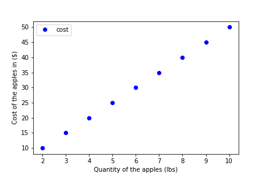
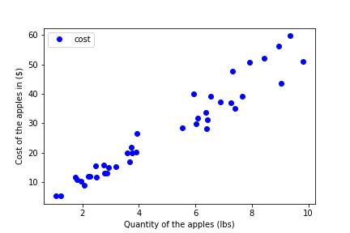
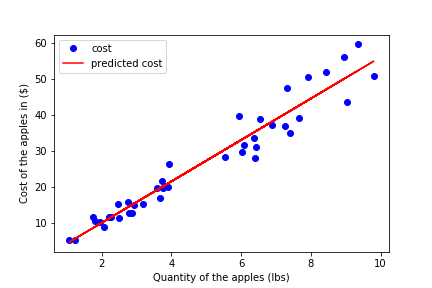

# Linear Regression
#### Understanding a Linear Relationship
Imagine that you are buying some apples at a market. The apples cost $5.00 per lbs. You pick up 1.5 lbs and end up paying 7.5 dollar. The total cost of the apples depends on the quantity of the apples you pick. Let's assume you buy apple in different quantities ( 2, 3,...,10 lbs) at the same price point and record all the costs and quantities.  If you plot the cost and quantities of the apples as the figure below.



You can see that the dots form a *straight line*. This relation is an example of **linear relationship**.  

If we express the line in the format of

$y= a\times x + b$

or

$y= slope\times x + intercept$

we will get the following

$Total Cost Of Apples=Price \times Quantity + Underline Cost$


For the simplicity, we will assume $UnderlineCost$ is zero. The amount of apple you are buying is the **independent variable** because you control the amount, and it does *not depend* on other variables. The total cost of apple is the **dependent variable** because the cost *depends* on the amount you choose. The price ($/lbs) of the apple is the coefficient/slope of the independent variable.

## Linear Regression
You have been keeping track of how much you spent on apple each time you go to grocery stores. The cost can be different. You might buy apples at different grocery stores, or different times of the year. The price of the apple can vary based on the season of the years, how each store price the apples, and inflation, etc. Over the years, you have collected a large data set of the costs and the quantities.

One day you decide to open a pie shop and you are planning to sell apple pies. You have to purchase apples at the quantities that are larger than you normally buy. You realize that you need to figure out a budget for the apples. You ask yourself the question

>*"What is the likely cost of 180 lbs of apples for this month?"*

You suddenly remember you have the dataset. You might be able to predict the cost from all the past data. However, you cannot simply connect the dots to form a straight line. You have to make the best effort to fit the line into the figure to explain the relationship between dependent and independent variables. This is an example of **linear regression**.

Linear regression is an approach to describe the linear relationship between dependent variable and independent variable(s). The case when there is only one independent variable is called **simple linear regression**. **Multiple linear regression** is when there are more than one independent variable. Imagine your shop is selling not only apple pies, but also peach pies. You need to predict the cost of the fruits.

## Prediction From Linear Regression
Linear Regression usually adopt the **least square** approach to describe the relationship. Least square approach minimizes the square of the differences between the predicted values and measured values. In this case, the values are the costs of the apples.

We can use `scipy` library in python to achieve linear regression.

Lets try to predict the likely cost of 180 lbs apple from our dataset.

To demonstrate linear regression, we are going to import necessary libraries and produce some dummy data.

```python
from scipy import stats
import matplotlib.pyplot as plt
import random

# number of time you have purchased apples at stores
number_of_purchases = 40
# the quantities you purchased in lbs rounded to 2 decimal points
quantities_purchased = [round(random.uniform(1.0, 10.0),2) for i in range(0, number_of_purchases)]
# the price point at the time of each purchase
price_points = [round(random.uniform(4.0, 7.0),2) for i in range(0, number_of_purchases)]
# the cost of apples
costs = [quantities_purchased[i]*price_points[i] for i in range(0, number_of_purchases)]
```
Let's plot the dummy data



As you can see you cannot form a straight line by connecting all the dots. Let's try to fit the line with linear regression.

```python
reg = stats.linregress(quantities_purchased, costs)
print(reg.slope)
print(reg.intercept)
```
>4.933814751192114  
>2.0781993693435297



Use the line equation

$y= slope\times x + intercept$

```python
budget = reg.slope*180 + reg.intercept
print(budget)
```
>890.164854583924

We predict the expected cost of 180 lbs of apples for your pie store via linear regression.
